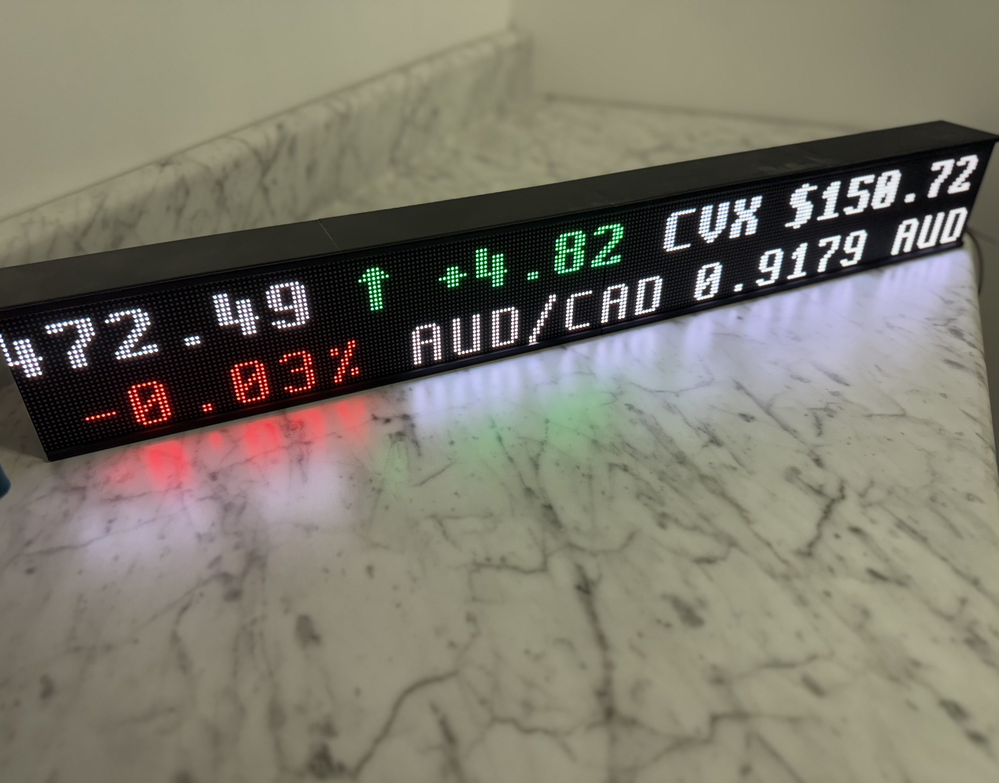
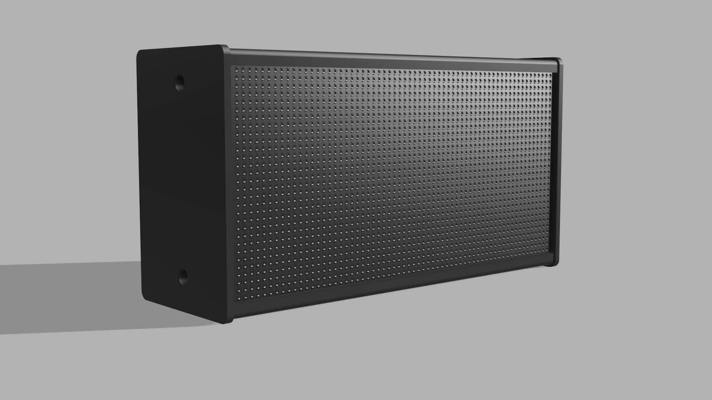
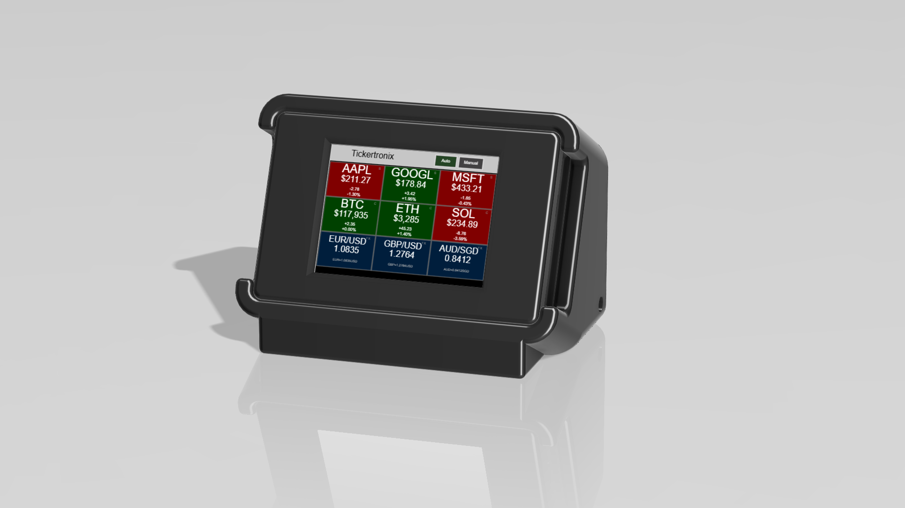

# Tickertronix-Open

> Open-source real-time financial ticker display system with Raspberry Pi hub and multiple display options

[](assets/hero/hero.jpg)  
Tickertronix hub with Matrix Portal display (example build).

[](LICENSE)

## Overview

Tickertronix-Open is a modular financial ticker system that transforms affordable hardware into professional-grade market displays. The system consists of a Raspberry Pi hub that fetches real-time market data and serves it to various display devices over your local network.

### System Architecture

```
[Alpaca API] → [Raspberry Pi Hub] → [Display Devices]
   (Free Tier)    (Local Server)      (Matrix/CYD/Custom)
```

**Key Features:**
- No cloud dependencies - runs entirely on your local network
- Free-tier API data (Alpaca Markets)
- Multiple display options (LED matrices, LCD screens)
- Expandable architecture - build your own display clients
- HMAC authentication for secure device communication
- Real-time updates for stocks, crypto, and forex

---

## Hardware Components

### 1. Raspberry Pi Hub (Required)
The central data server that fetches and distributes market data.

**Hardware:**
- Raspberry Pi Zero 2 W or newer
- MicroSD card (8GB+)
- 5V power supply

**Features:**
- Fetches data from Alpaca (stocks/crypto) and Twelve Data (forex)
- SQLite database for credentials and price history
- REST API on port 5001
- mDNS support (access via tickertronixhub.local)
- Automatic updates every 5 minutes
- Web UI for configuration

[**→ Full Setup Guide**](raspberry-pi-hub/README.md)

---

### 2. Matrix Portal Scroll (LED Matrix Scrolling Display)
Continuous scrolling ticker across one or multiple 64x32 LED matrix panels.

**Hardware:**
- Adafruit Matrix Portal S3
- 64x32 RGB LED Matrix Panel(s) (1-6 panels)
- 5V/4A+ power supply
 3D Printed Enclosure (3D Files Located at matrix-portal-scroll/3D Files)
- 4 x M6 X 10mm x 7mm Heat Inserts (2 needed for each additional panel)
- 4 x M6 x 10mm Button Head Screws (for end caps)
- M6 x 25mm Socket Head Cap Screws (2 screws needed for connecting enclosures for each panel)
- 4 x M2 x 6mm x 3.5mm heat inserts (for mounting Matrix Portal S3 to RH Endcap)
- 4 x m2 x 8mm Screws (for securing Matrix Portal S3 board to RH Endcap)
- 5/16 by 1 1/4 inch fluted wood dowels (2 per panel to align enclosures)
- 20mm rocker switch  (for switching A1 to GRND for provisioning)

**Features:**
- Smooth scrolling ticker display
- Multi-panel support (chain up to 6 panels)
- CircuitPython firmware
- WiFi provisioning via captive portal
- Customizable fonts and scroll speed
- 3D printable enclosure
- Release bundle: `matrix-portal-scroll.zip` on GitHub Releases (or build locally with `./scripts/build_matrix_portal_releases.sh`)

  
Matrix Portal Scroll multi-panel build.

[**→ Full Setup Guide**](matrix-portal-scroll/README.md) | [**→ Setup Instructions**](matrix-portal-scroll/SETUP_INSTRUCTIONS.md)

---

### 3. Matrix Portal Single (LED Matrix Single-Asset Display)
Shows one asset at a time on a 64x32 LED panel, cycling through your watchlist.

**Hardware:**
- Adafruit Matrix Portal S3
- Single 64x32 P3 RGB LED Matrix Panel 
- 5V power supply
- 3D Printed Enclosure (3D Files Located at matrix-portal-single/3D Files)
- 4 x M6 X 10mm x 7mm Heat Inserts
- 4 x M6 x 10mm Button Head Screws
- 20mm rocker switch  (for switching A1 to GRND for provisioning)

**Features:**
- Full-screen single-asset display
- Configurable dwell time (default 2.5s)
- Asset class ordering (stocks/crypto/forex)
- Minimal flicker transitions
- 4-color palette (black/white/green/red)
- 3D printable enclosure
- Release bundle: `matrix-portal-single.zip` on GitHub Releases (or build locally with `./scripts/build_matrix_portal_releases.sh`)

  
Matrix Portal Single one-panel build.

[**→ Full Setup Guide**](matrix-portal-single/README.md)

---

### 4. CYD Ticker (Cheap Yellow Display)
Touchscreen ticker display with interactive provisioning and stock browsing.

**Hardware:**
- ESP32-2432S028R (Cheap Yellow Display)
- USB-C cable for power
- Optional: 3D printed enclosure (3D files located in cyd-ticker-il9341/3D Files)
- 4 x M2 x 6mm x 3.5mm heat press inserts (for enclosure)
- 4 x m2 x 18mm socket head cap screws (for enclosure)

**Features:**
- 320x240 ILI9341 touchscreen display
- Touch-based WiFi provisioning
- Multi-asset cycling display
- Retro-styled UI with color-coded changes
- Local hub mode (no cloud authentication)
- SD card support for logging
- 3D printable retro case

  
CYD Ticker assembled build (ESP32-2432S028R).

[**→ Full Setup Guide**](cyd-ticker-il9341/README.md)

---

## Quick Start

### 1. Set Up the Hub (15 minutes)
```bash
git clone https://github.com/Tickertronix/Tickertronix-Open.git
cd Tickertronix-Open/raspberry-pi-hub
sudo ./setup.sh
tickertronix setup-credentials  # Enter your Alpaca API credentials
tickertronix start
```

### 2. Set Up Your Display Device
Choose one or more display options and follow their respective setup guides linked above.

### 3. Verify Connection
```bash
curl http://tickertronixhub.local:5001/health
curl http://tickertronixhub.local:5001/prices
```

## Release Bundles (Matrix Portal devices)
- User downloads: `matrix-portal-scroll.zip` and `matrix-portal-single.zip` will be attached to GitHub Releases for drag-and-drop flashing to `CIRCUITPY`.
- Maintainer build: run `./scripts/build_matrix_portal_releases.sh` to regenerate both ZIPs in `dist/`.

---

## API Documentation

The Raspberry Pi Hub exposes a REST API for custom integrations:

### Endpoints

| Endpoint | Description |
|----------|-------------|
| `GET /health` | Health check |
| `GET /prices` | All tracked asset prices |
| `GET /prices/stocks` | Stock prices only |
| `GET /prices/crypto` | Crypto prices only |
| `GET /prices/forex` | Forex prices only |
| `GET /prices/{asset_class}/{symbol}` | Specific asset price |

**Example Response:**
```json
{
  "stocks": [
    {
      "symbol": "AAPL",
      "name": "Apple Inc",
      "price": 178.32,
      "change": 2.45,
      "change_percent": 1.39,
      "timestamp": "2025-12-11T14:30:00Z"
    }
  ]
}
```

---

## Prerequisites

### Required Accounts
1. **Alpaca Markets** (Free)
   - Sign up: https://alpaca.markets
   - Get API credentials from dashboard
   - Free tier includes real-time stock and crypto data

2. **Twelve Data** (Optional, for Forex)
   - Sign up: https://twelvedata.com
   - Free tier: 800 API calls/day
   - Only needed if tracking forex pairs

### Hardware Requirements by Component
- **Raspberry Pi Hub**: Any Raspberry Pi with WiFi (Zero 2 W, 3, 4, 5)
- **Matrix Portal**: Adafruit Matrix Portal S3 + LED panels
- **CYD Ticker**: ESP32-2432S028R (~$15 on AliExpress)

---

## Project Structure

```
Tickertronix-Open/
├── raspberry-pi-hub/          # Raspberry Pi data hub
│   ├── docs/                  # Deployment guides
│   ├── scripts/               # Setup scripts
│   └── README.md
├── matrix-portal-scroll/      # Multi-panel scrolling display
│   ├── fonts/                 # BDF fonts
│   ├── lib/                   # CircuitPython libraries
│   └── README.md
├── matrix-portal-single/      # Single-panel paging display
│   ├── 3D Files/              # STL files for enclosure
│   └── README.md
├── cyd-ticker-il9341/         # CYD touchscreen display
│   ├── CYD_Complete_System/   # Arduino/PlatformIO code
│   ├── 3D Files/              # STL files for retro case
│   └── README.md
└── README.md                  # This file
```

---

## Building Your Own Display Client

The Hub's API is device-agnostic. You can build custom displays using:
- ESP32/ESP8266 (Arduino/MicroPython)
- Raspberry Pi Pico W
- Web dashboards (HTML/JavaScript)
- Desktop applications (Python/Electron)
- Mobile apps

**Authentication Options:**
1. **Local Hub Mode**: Direct HTTP access (no auth required within LAN)
2. **HMAC Mode**: Secure HMAC-SHA256 authentication for cloud/remote access

Reference implementations:
- CYD: `cyd-ticker-il9341/CYD_Complete_System/api_functions.ino`
- Matrix Portal: `matrix-portal-scroll/api_client.py`

---

## Security Notes

1. **Default Credentials**: If using the pre-built Pi image, default login is:
   - Username: `tickertronix`
   - Password: `tickertronix`
   - **Change immediately** after first login: `passwd`

2. **Network Security**:
   - Hub API runs on local network (port 5001)
   - No internet exposure by default
   - Consider firewall rules if needed

3. **API Keys**:
   - Stored securely in SQLite database
   - Never committed to git
   - Use environment variables for systemd service

---

## Troubleshooting

### Hub Issues
```bash
# Check service status
sudo systemctl status tickertronix-hub

# View logs
journalctl -u tickertronix-hub -f

# Restart service
sudo systemctl restart tickertronix-hub
```

### Display Device Issues
- **No data**: Verify hub URL in device config
- **WiFi issues**: Re-provision device (ground A1 pin on boot for Matrix Portal)
- **Authentication errors**: Ensure hub is running and accessible

### Network Discovery
```bash
# If mDNS fails, find Pi IP
ping tickertronixhub.local  # Should resolve to Pi's IP
# Or check router DHCP leases

# Test direct IP access
curl http://192.168.1.XXX:5001/health
```

---

## Contributing

Contributions welcome! This is an open-source project under the MIT license.

**Areas for contribution:**
- New display device implementations
- Additional data sources
- UI improvements
- Documentation enhancements
- 3D printable enclosures

See [CONTRIBUTING.md](CONTRIBUTING.md) for guidelines.

---

## License

MIT License - see [LICENSE](LICENSE) file for details.

Copyright (c) 2025 Tickertronix LLC
---

## Links

- **Documentation**: See individual component README files
- **Issues**: [GitHub Issues](https://github.com/Tickertronix/Tickertronix-Open/issues)
- **Discussions**: [GitHub Discussions](https://github.com/Tickertronix/Tickertronix-Open/discussions)

---

## Acknowledgments

- Alpaca Markets for free-tier market data API
- Adafruit for Matrix Portal hardware and CircuitPython
- ESP32 community for CYD development resources
